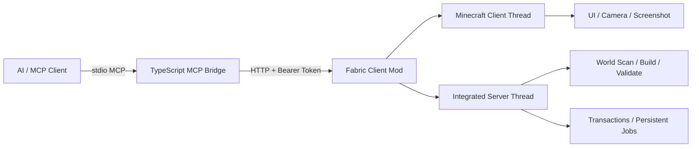
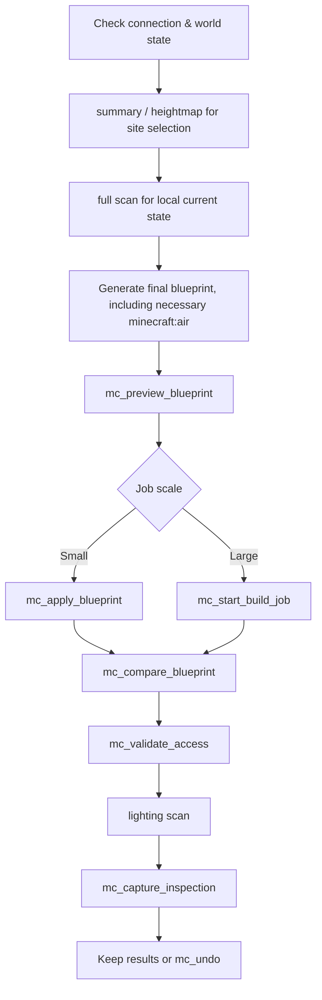

# MC Architect MCP

[](https://www.minecraft.net/)
[](https://fabricmc.net/)
[](https://modelcontextprotocol.io/)
[](LICENSE)

**MC Architect MCP** is a Minecraft Java single-player world construction system designed for AI/MCP clients. It reads and modifies the live world via a local Fabric Mod, while the TypeScript MCP Bridge provides high-level tools for terrain scanning, blueprint application, geometric generation, path validation, lighting inspection, screenshot acceptance, and persistent undo.

> English summary: a local Fabric mod and MCP server for inspecting, building, validating, photographing, and undoing changes in Minecraft Java single-player worlds.

## Feature Overview

- **32 MCP tools**: Covering world control, investigation, construction, validation, photography, and recovery.
- **Five world scan types**: `summary`, `heightmap`, `collision`, `lighting`, `full`.
- **Blueprint workflow**: Preview, atomic application, live-world comparison, and explicit air verification.
- **Parametric construction**: Boxes, enclosure walls, columns, gable roofs, circles, curved walls, domes, and spiral stairs.
- **Region editing**: Copy, rotate, mirror, array, and replace by block state.
- **Accessibility validation**: Checks traversal routes for standard players based on real collision shapes.
- **Large-scale construction jobs**: Tick-by-tick execution, supporting pause, resume, cancel, and crash recovery.
- **Persistent undo**: Transaction logs written to the save file, allowing undo by transaction or grouped contiguous projects.
- **Visual acceptance**: Restorable spectator camera sessions and HUD-less world screenshots.
- **Local communication**: Listens only on the loopback address, authenticated via a random Bearer Token.

## System Architecture



### Component Responsibilities

- `bridge/`: Registers MCP tools, validates parameters, calls the local HTTP API, and compresses high-level geometry into cuboid blueprints.
- `mod/`: Executes live world reads and writes within the Minecraft process, handling thread switching, safety checks, transactions, background jobs, and screenshots.
- `docs/protocol.md`: Local HTTP protocol between the Bridge and the Mod.
- `bridge/scripts/`: Project-level examples including the Forbidden City, Meridian Gate, Science Harbor, Tokamak, statues, and pixel art.

## Environment Requirements

| Component | Version |
|---|---:|
| Minecraft Java Edition | 1.21.11 |
| Fabric Loader | 0.18.6 or higher |
| Fabric API | 0.141.3+1.21.11 |
| Java | 21 |
| Node.js | 20 or higher |

Current project version: **0.5.0**.

## Quick Start

### 1. Build the Fabric Mod

```powershell
cd mod
.\gradlew.bat build
```

Build output:

```text
mod/build/libs/mcarchitect-0.5.0.jar
```

Place this JAR and the corresponding version of Fabric API into the `mods` folder of your Minecraft instance.

### 2. First Minecraft Launch

Launch Minecraft with the mod. The first run will generate:

```text
%APPDATA%\.minecraft\config\mcarchitect.json
```

Example:

```json
{
  "port": 8765,
  "token": "RANDOM_LOCAL_TOKEN"
}
```

The HTTP service binds exclusively to `127.0.0.1`. All requests require this token, except for the health check endpoint.

### 3. Build the MCP Bridge

```powershell
cd bridge
npm ci
npm run build
npm test
```

### 4. Configure MCP Client

```json
{
  "mcpServers": {
    "minecraft": {
      "command": "node",
      "args": ["D:/path/to/mc-architect-mcp/bridge/dist/index.js"]
    }
  }
}
```

If using a non-default Minecraft instance directory, set `MCA_CONFIG` to the full path of the config file:

```powershell
$env:MCA_CONFIG = 'D:\MinecraftInstance\config\mcarchitect.json'
```

### 5. Connect to a World

You can either manually join a single-player world or initiate the process from the title screen:

1. `mc_health`
2. `mc_list_worlds`
3. `mc_open_world`
4. Poll `mc_ui_state` until `worldOpen` returns `true`

Once finished, call `mc_disconnect` to save the world and return to the title screen.

## Recommended Construction Workflow



## MCP Tools Overview

### World & Client

| Tool | Description |
|---|---|
| `mc_health` | Checks mod availability and single-player world status |
| `mc_ui_state` | Gets the current UI state and local world status |
| `mc_list_worlds` | Lists compatible single-player saves |
| `mc_open_world` | Opens a specified save from the title screen |
| `mc_disconnect` | Saves and returns to the title screen |
| `mc_get_context` | Gets player position, view direction, dimension, and game mode |

### Investigation & Validation

| Tool | Description |
|---|---|
| `mc_scan_region` | Terrain, precise block, collision, or lighting scan |
| `mc_validate_access` | Validates traversal routes for a standard player from a start point to multiple targets |
| `mc_compare_blueprint` | Compares the blueprint's final state against the live world |

### Blueprint & Region Editing

| Tool | Description |
|---|---|
| `mc_preview_blueprint` | Analyzes changes, materials, chunks, block entities, and player collisions |
| `mc_apply_blueprint` | Atomically applies up to 256 cuboid operations |
| `mc_transform_region` | Copies, rotates, mirrors, or arrays existing regions |
| `mc_replace_blocks` | Replaces blocks by base ID or exact state |
| `mc_fill` | Fills a rectangular region |

### Parametric Geometry

| Tool | Description |
|---|---|
| `mc_build_box` | Solid, hollow, or frame-only boxes |
| `mc_build_walls` | Four-sided enclosure walls |
| `mc_build_columns` | Batch square columns |
| `mc_build_gable_roof` | Stepped gable roofs |
| `mc_build_circle` | Horizontal or vertical circles/discs |
| `mc_build_curved_wall` | Curved walls within a specified angular range |
| `mc_build_dome` | Solid or hollow hemisphere domes |
| `mc_build_spiral_stairs` | Spiral stairs with auto-calculated tangent facing |

### Camera & Screenshots

| Tool | Description |
|---|---|
| `mc_camera_begin` | Saves player state and starts a temporary inspection session |
| `mc_camera_move` | Moves camera and sets Yaw, Pitch, and FOV |
| `mc_camera_restore` | Restores position, view, mode, and FOV |
| `mc_capture_view` | Captures the current HUD-less world view |
| `mc_capture_inspection` | Automatically captures up to 12 stable angles and restores state |

### Jobs & Undo

| Tool | Description |
|---|---|
| `mc_start_build_job` | Starts a persistent background construction job |
| `mc_build_job_status` | Queries current job status and progress |
| `mc_control_build_job` | Pauses, resumes, or cancels a job |
| `mc_list_transactions` | Lists persistent undo transactions |
| `mc_undo` | Undoes the latest transaction or latest contiguous project |

## Scan Modes

| Mode | Returns | Use Case |
|---|---|---|
| `summary` | Height, slope, coverage, flat area candidates | Large-scale site selection |
| `heightmap` | Surface height per column, block states, and terrain categories | Foundations & terrain seams |
| `collision` | `standable`, `passable`, `blocked` | Doorways, corridors, and stair checks |
| `lighting` | Sky light, block light, and dark standable positions | Interior lighting and mob spawn risks |
| `full` | Complete block state palette and RLE data | Precise local decoration & repair |

## Blueprint Example

The following blueprint constructs a 9×5×9 hollow room, explicitly preserving internal air:

```json
{
  "label": "stone room",
  "projectId": "demo-room",
  "operations": [
    {
      "from": { "x": 0, "y": 64, "z": 0 },
      "to": { "x": 8, "y": 68, "z": 8 },
      "block": "minecraft:stone_bricks"
    },
    {
      "from": { "x": 1, "y": 65, "z": 1 },
      "to": { "x": 7, "y": 67, "z": 7 },
      "block": "minecraft:air"
    }
  ]
}
```

It is recommended to call `mc_preview_blueprint` with the same set of operations first, and then call `mc_compare_blueprint` after construction. Explicit air blocks can help detect passages, doorways, and rooms accidentally blocked by subsequent decorations.

Block IDs support full state strings:

```text
minecraft:oak_stairs[facing=north,half=bottom,shape=straight,waterlogged=false]
```

## Transactions, Projects, & Background Jobs

### Atomic Construction

During direct blueprint application, if an exception occurs mid-process, the mod will revert any modified blocks to their pre-construction state. A transaction is only considered complete after both world modifications and the undo log are successfully persisted.

### Project Grouping

Assign the same `projectId` to multiple consecutive transactions to revert the entire contiguous project stack in one `mc_undo` call. Transactions strictly follow stack order and will not skip over other projects to revert older transactions.

Transaction logs are located at:

```text
WORLD_SAVE/mcarchitect/transactions/*.json.gz
```

The most recent **100** transactions are preserved with the save file and loaded across game restarts.

### Large Jobs

Background jobs modify up to **2,048** blocks per server tick. Plans and progress are saved in:

```text
WORLD_SAVE/mcarchitect/jobs/
```

Incomplete jobs resume in a paused state after a crash or restart and require an explicit `resume` call. Canceling a job restores modified blocks based on checkpoints; completed jobs are converted into standard undo transactions.

## Limits & Safeguards

| Item | Current Limit |
|---|---:|
| Cuboids per blueprint | 256 |
| Unique blocks per blueprint | 262,144 |
| Blocks per precise/collision/lighting scan | 262,144 |
| X/Z columns per surface scan | 262,144 |
| Path validation targets | 32 |
| Multi-angle screenshots | 12 |
| Persistent undo transactions | 100 |
| Background job speed | 2,048 blocks/tick |
| HTTP request body | 256 KiB |

Other behaviors:

- Target chunks must already be loaded.
- Construction must not intersect with the player's collision box.
- Direct construction and undo are disabled while a background job is active.
- The current version does not read or write block entity NBT, nor does it overwrite entities like chests or signs.
- Access validation uses a conservative block-unit search and does not fully simulate sprint-jumping, swimming, crawling, or all local collision boundaries.
- Currently targets local Minecraft Java single-player worlds and integrated servers.

## Security Model

- HTTP service only listens on `127.0.0.1`.
- Default port is `8765`.
- Generates a 32-byte random token on first launch.
- All endpoints except `/v1/health` require `Authorization: Bearer TOKEN`.
- World operations are dispatched to the Minecraft integrated server thread.
- UI, camera, and screenshot operations are dispatched to the client thread.
- Previews report unloaded chunks, block entities, and player collisions without modifying the world.

Full protocol details are available at [`docs/protocol.md`](docs/protocol.md).

## Development & Testing

### Bridge

```powershell
cd bridge
npm ci
npm run check
npm test
```

Existing test coverage includes:

- Circle fill compression and center points
- Curved wall heights
- Hollow dome boundaries
- Spiral stair auto-facing
- Hollow box non-overlapping surfaces
- Degenerate handling for single-block axis frame boxes

### Mod

```powershell
cd mod
.\gradlew.bat build
```

### Project Statistics

- Production source code: ~**3,294 lines**
- Core project (incl. tests, protocol, config): ~**3,655 lines**
- Including construction example scripts: ~**7,982 lines**

Statistics exclude dependencies, build artifacts, Gradle cache, test worlds, and screenshots.

## Example Scripts

The `bridge/scripts/` directory contains practical project scripts, such as:

- Forbidden City, Meridian Gate, and Courtyards
- Hall of Supreme Harmony River Channel
- Sky Science Harbor
- Tokamak Device
- Furina Statue & Pixel Art
- Scanning, validation, and multi-angle screenshot scripts

These scripts contain specific coordinates and project parameters. Before running, verify coordinates in a backup world and use preview tools to check the modification scope.

## License

[MIT](LICENSE)
