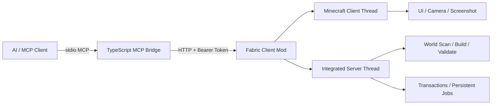
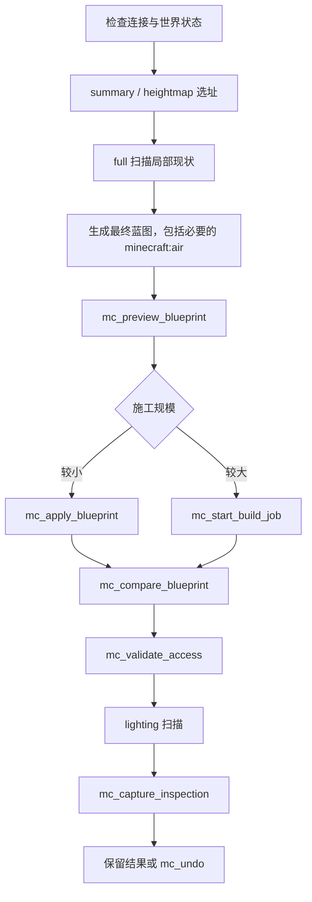

# MC Architect

[](https://www.minecraft.net/)
[](https://fabricmc.net/)
[](https://modelcontextprotocol.io/)
[](LICENSE)

**MC Architect** 是一套面向 AI/MCP 客户端的 Minecraft Java 单人世界建筑系统。它通过本地 Fabric Mod 读取和修改真实世界，再由 TypeScript MCP Bridge 提供地形扫描、蓝图施工、几何生成、路径验证、照明检查、截图验收和持久化撤销等高层工具。

> English summary: a local Fabric mod and MCP server for inspecting, building, validating, photographing, and undoing changes in Minecraft Java single-player worlds.

## 功能概览

- **32 个 MCP 工具**：覆盖世界控制、调查、施工、验证、摄影和恢复。
- **五种世界扫描**：`summary`、`heightmap`、`collision`、`lighting`、`full`。
- **蓝图工作流**：预览、原子应用、实际世界对比和显式空气校验。
- **参数化建筑**：盒体、围墙、立柱、双坡屋顶、圆、弧墙、穹顶和螺旋楼梯。
- **区域编辑**：复制、旋转、镜像、阵列和按方块状态替换。
- **可用性验收**：基于真实碰撞形状检查普通玩家通行路线。
- **大型施工任务**：分 Tick 执行，支持暂停、恢复、取消和重启恢复。
- **持久化撤销**：事务日志写入存档，可按事务或连续项目分组撤销。
- **视觉验收**：可恢复的旁观相机会话和无 HUD 世界截图。
- **本地通信**：只监听回环地址，并使用随机 Bearer Token 鉴权。

## 系统架构



### 组件职责

- `bridge/`：注册 MCP 工具、验证参数、调用本地 HTTP API，并把高层几何压缩为 cuboid 蓝图。
- `mod/`：在 Minecraft 进程内执行真实世界读取和修改，处理线程切换、风险检查、事务、后台任务和截图。
- `docs/protocol.md`：Bridge 与 Mod 之间的本地 HTTP 协议。
- `bridge/scripts/`：故宫、午门、科研港、托卡马克、雕像和像素画等项目级示例。

## 环境要求

| 组件 | 版本 |
|---|---:|
| Minecraft Java Edition | 1.21.11 |
| Fabric Loader | 0.18.6 或更高 |
| Fabric API | 0.141.3+1.21.11 |
| Java | 21 |
| Node.js | 20 或更高 |

当前项目版本：**0.5.0**。

## 快速开始

### 1. 构建 Fabric Mod

```powershell
cd mod
.\gradlew.bat build
```

构建产物：

```text
mod/build/libs/mcarchitect-0.5.0.jar
```

把该 JAR 和对应版本的 Fabric API 放入 Minecraft 实例的 `mods` 目录。

### 2. 首次启动 Minecraft

启动带 Mod 的 Minecraft。首次运行会创建：

```text
%APPDATA%\.minecraft\config\mcarchitect.json
```

示例：

```json
{
  "port": 8765,
  "token": "RANDOM_LOCAL_TOKEN"
}
```

HTTP 服务只绑定 `127.0.0.1`。除健康检查外，所有请求都需要该 Token。

### 3. 构建 MCP Bridge

```powershell
cd bridge
npm ci
npm run build
npm test
```

### 4. 配置 MCP 客户端

```json
{
  "mcpServers": {
    "minecraft": {
      "command": "node",
      "args": ["D:/path/to/mc-architect/bridge/dist/index.js"]
    }
  }
}
```

如果使用非默认 Minecraft 目录，设置 `MCA_CONFIG` 为完整配置文件路径：

```powershell
$env:MCA_CONFIG = 'D:\MinecraftInstance\config\mcarchitect.json'
```

### 5. 连接世界

可以先手动进入单人世界，也可以从标题界面调用：

1. `mc_health`
2. `mc_list_worlds`
3. `mc_open_world`
4. 轮询 `mc_ui_state`，直到 `worldOpen` 为 `true`

完成后可调用 `mc_disconnect` 保存世界并返回标题界面。

## 推荐建筑流程



## MCP 工具一览

### 世界和客户端

| 工具 | 作用 |
|---|---|
| `mc_health` | 检查 Mod 和单人世界是否可用 |
| `mc_ui_state` | 获取当前界面和本地世界状态 |
| `mc_list_worlds` | 列出兼容的单人存档 |
| `mc_open_world` | 从标题界面打开指定存档 |
| `mc_disconnect` | 保存并返回标题界面 |
| `mc_get_context` | 获取玩家位置、视角、维度和游戏模式 |

### 调查和验证

| 工具 | 作用 |
|---|---|
| `mc_scan_region` | 地形、精确方块、碰撞或光照扫描 |
| `mc_validate_access` | 检查起点到多个目标的普通玩家路线 |
| `mc_compare_blueprint` | 比较蓝图最终状态与真实世界 |

### 蓝图和区域编辑

| 工具 | 作用 |
|---|---|
| `mc_preview_blueprint` | 分析改动、材料、区块、方块实体和玩家碰撞 |
| `mc_apply_blueprint` | 原子应用最多 256 个 cuboid 操作 |
| `mc_transform_region` | 复制、旋转、镜像或阵列现有区域 |
| `mc_replace_blocks` | 按基础 ID 或精确状态替换方块 |
| `mc_fill` | 填充一个长方体区域 |

### 参数化几何

| 工具 | 作用 |
|---|---|
| `mc_build_box` | 实心、空心或仅边框盒体 |
| `mc_build_walls` | 四周围墙 |
| `mc_build_columns` | 批量方形立柱 |
| `mc_build_gable_roof` | 阶梯式双坡屋顶 |
| `mc_build_circle` | 水平或垂直圆/圆盘 |
| `mc_build_curved_wall` | 指定角度范围的弧形墙 |
| `mc_build_dome` | 实心或空心上半球穹顶 |
| `mc_build_spiral_stairs` | 自动计算切线朝向的螺旋楼梯 |

### 相机和截图

| 工具 | 作用 |
|---|---|
| `mc_camera_begin` | 保存玩家状态并开始临时检查会话 |
| `mc_camera_move` | 移动相机并设置 Yaw、Pitch 和 FOV |
| `mc_camera_restore` | 恢复位置、视角、模式和 FOV |
| `mc_capture_view` | 捕获当前无 HUD 世界画面 |
| `mc_capture_inspection` | 自动拍摄最多 12 个稳定视角并恢复状态 |

### 任务和撤销

| 工具 | 作用 |
|---|---|
| `mc_start_build_job` | 启动持久化后台施工任务 |
| `mc_build_job_status` | 查询当前任务状态和进度 |
| `mc_control_build_job` | 暂停、恢复或取消任务 |
| `mc_list_transactions` | 列出持久化撤销事务 |
| `mc_undo` | 撤销最新事务或最新连续项目 |

## 扫描模式

| 模式 | 返回内容 | 适用场景 |
|---|---|---|
| `summary` | 高度、坡度、覆盖率、平坦区域候选 | 大范围选址 |
| `heightmap` | 每列地表高度、方块状态和地形类别 | 地基与地形接缝 |
| `collision` | `standable`、`passable`、`blocked` | 门洞、走廊和楼梯检查 |
| `lighting` | 天空光、方块光和黑暗可站立位置 | 室内照明和刷怪风险 |
| `full` | 完整方块状态调色板和 RLE 数据 | 局部精确装修与修复 |

## 蓝图示例

以下蓝图构建一个 9×5×9 空心房间，并显式保留内部空气：

```json
{
  "label": "stone room",
  "projectId": "demo-room",
  "operations": [
    {
      "from": { "x": 0, "y": 64, "z": 0 },
      "to": { "x": 8, "y": 68, "z": 8 },
      "block": "minecraft:stone_bricks"
    },
    {
      "from": { "x": 1, "y": 65, "z": 1 },
      "to": { "x": 7, "y": 67, "z": 7 },
      "block": "minecraft:air"
    }
  ]
}
```

建议先用同一组操作调用 `mc_preview_blueprint`，施工后再调用 `mc_compare_blueprint`。显式空气可以发现后续装饰误堵的通道、门洞和房间。

方块 ID 支持完整状态：

```text
minecraft:oak_stairs[facing=north,half=bottom,shape=straight,waterlogged=false]
```

## 事务、项目和后台任务

### 原子施工

直接蓝图施工时，如果中途发生异常，Mod 会把已经修改的方块恢复到施工前状态。只有世界修改和撤销日志都成功持久化后，事务才算完成。

### 项目分组

给多个连续事务设置同一个 `projectId`，即可通过一次 `mc_undo` 撤销栈顶连续项目。事务严格遵守栈顺序，不会跨过其他项目撤销旧事务。

事务日志位于：

```text
WORLD_SAVE/mcarchitect/transactions/*.json.gz
```

最近 **100** 个事务会随存档保留并跨游戏重启加载。

### 大型任务

后台任务每个服务器 Tick 最多修改 **2,048** 个方块。计划和进度保存在：

```text
WORLD_SAVE/mcarchitect/jobs/
```

未完成任务在崩溃或重启后以暂停状态恢复，需要显式调用 `resume`。取消任务会根据检查点恢复已修改的方块；完成任务会转换成普通撤销事务。

## 限制和保护

| 项目 | 当前限制 |
|---|---:|
| 单次蓝图 cuboid 数 | 256 |
| 单次蓝图唯一方块数 | 262,144 |
| 精确/碰撞/光照扫描方块数 | 262,144 |
| 地表扫描 X/Z 列数 | 262,144 |
| 路径验证目标数 | 32 |
| 多视角截图数 | 12 |
| 持久化撤销事务数 | 100 |
| 后台任务速度 | 2,048 方块/Tick |
| HTTP 请求体 | 256 KiB |

其他行为：

- 目标区块必须已经加载。
- 施工不得与玩家碰撞体相交。
- 活动后台任务期间禁止直接施工和撤销。
- 当前版本不读写方块实体 NBT，也不会覆盖箱子、告示牌等方块实体。
- 通行验证是保守的方块单元搜索，不完整模拟冲刺跳跃、游泳、爬行及所有局部碰撞边界。
- 目前面向本地 Minecraft Java 单人世界和集成服务器。

## 安全模型

- HTTP 服务只监听 `127.0.0.1`。
- 默认端口为 `8765`。
- 首次启动生成 32 字节随机 Token。
- 除 `/v1/health` 外的端点均要求 `Authorization: Bearer TOKEN`。
- 世界操作调度到 Minecraft 集成服务器线程。
- UI、相机和截图操作调度到客户端线程。
- 预览会报告未加载区块、方块实体和玩家碰撞，而不修改世界。

完整协议见 [`docs/protocol.md`](docs/protocol.md)。

## 开发与测试

### Bridge

```powershell
cd bridge
npm ci
npm run check
npm test
```

现有测试覆盖：

- 填充圆的压缩和中心点
- 弧形墙高度
- 空心穹顶边界
- 螺旋楼梯自动朝向
- 空心盒无重叠表面
- 单方块轴的边框盒退化处理

### Mod

```powershell
cd mod
.\gradlew.bat build
```

### 项目统计

- 正式运行源码：约 **3,294 行**
- 核心项目（含测试、协议和配置）：约 **3,655 行**
- 连同建筑示例脚本：约 **7,982 行**

统计不包含依赖、构建产物、Gradle 缓存、测试世界和截图。

## 示例脚本

`bridge/scripts/` 中包含实际项目脚本，例如：

- 故宫、午门和庭院
- 太和门河道
- 天空科研港
- 托卡马克装置
- 芙宁娜雕像与像素画
- 扫描、验证和多视角截图脚本

这些脚本包含具体坐标和项目参数，运行前请先在副本世界中检查坐标，并使用预览工具核对改动范围。

## License

[MIT](LICENSE)
